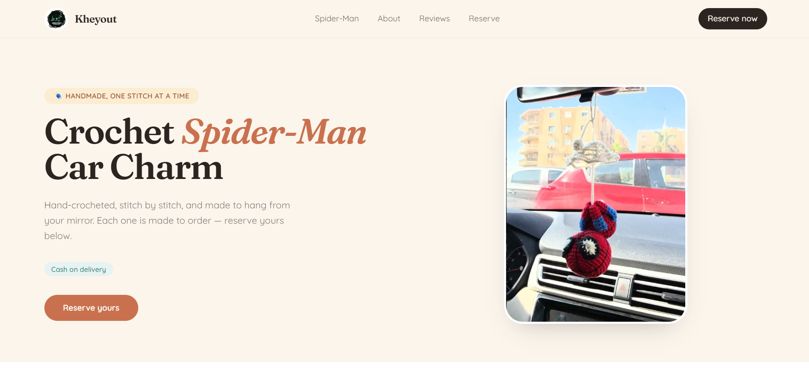

<!--
  Put your photo here. Replace "brand-photo.jpg" with your actual
  image filename, and place the image in the same folder as this README.
-->

# Kheyout 🧶

**Handmade fiber art, one thread at a time.**

[Instagram: @__khoyout](https://www.instagram.com/__khoyout/)

---

## Our Story

Hey there! I'm Holy, I'm 18, and I'm a fiber artist. I started my small
business, Kheyout, in August 2020, where I offer different kinds of
customized and handmade fiber art.

*Kheyout* means **"threads"** in Arabic — and that's really what this whole
thing is built on: one thread at a time, turned into something you can hold,
gift, or hang up and smile at.

What started as a small hobby turned into a small business making car
charms, plushies, and fully custom designs based on whatever the customer
has in mind. If you can describe it, there's a good chance it can be
crocheted.

I get to learn and try something new every day, and that's what I love most
in the journey 🤍

## What We Make

- 🕷️ Car charms (like our signature crochet Spider-Man)
- 🧸 Handmade plushies
- 🎨 Fully custom designs, made to order

## Why Handmade

- No machines, no mass production — just yarn, a hook, and a lot of patience
- Every piece is made one at a time, by hand
- Custom requests welcome — if you can describe it, it can probably be crocheted

## Get in Touch

- 📸 Instagram: [@__khoyout](https://www.instagram.com/__khoyout/)
- 💬 Introduce yourself in the comments and let's get to know each other more 🥰

---

<i>Made with 🤍 by Kheyout</i>

